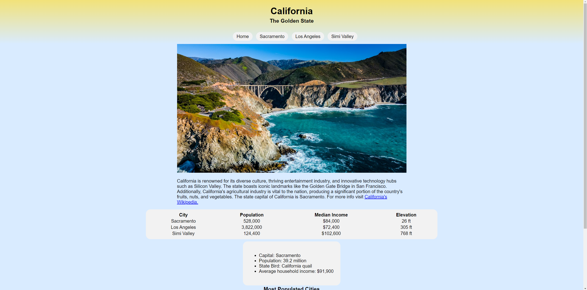
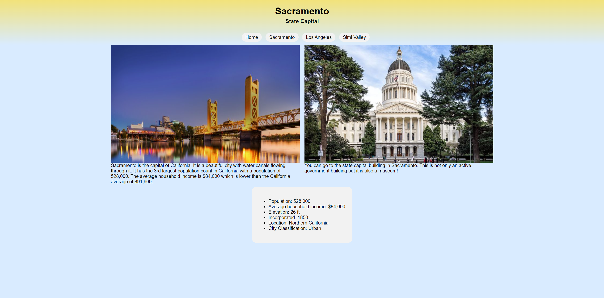
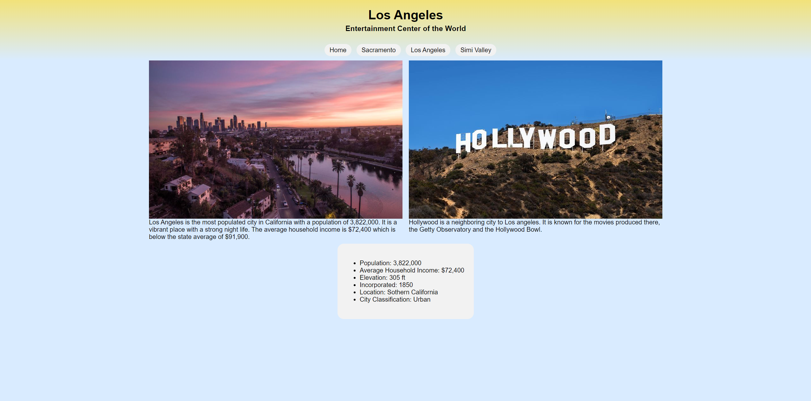
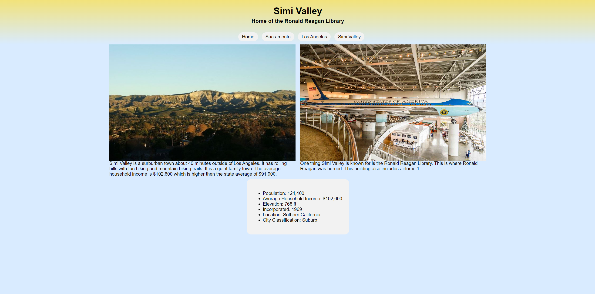

# Golden State Cities

## Description

This project is a website that provides information about the state of California and three selected cities: Simi Valley, Los Angeles, and Sacramento. Each city page includes information such as population, year of incorporation, region, classification (urban, suburban, rural), and average income level compared to the rest of the state.

## Features

- Individual pages for Simi Valley, Los Angeles, and Sacramento.
- Population, incorporation year, region, classification, and average income level for each city.
- Consistent navigation menu.
- Semantic elements for structured content.
- Ordered and unordered lists.
- Table to organize content.
- Form with fields for first name, last name, email, email confirmation, and question.
- JavaScript validation for email confirmation.

## Screenshots

#### Home Page

#### Sacramento Page

#### Los Angeles Page

#### Simi Valley Page

